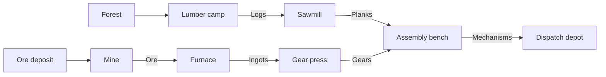

# Ironwood — proposed game plan

Status: the first playable has been extended with exploration, finite mining, crafting upgrades, fuel engines, and Cloudflare cooperative multiplayer. See README.md for delivered behavior, deployment, validation, and limits. The design below is the archived original single-player proposal.

## Concept

A single-player, top-down 3D factory game set on a medieval workshop island. The player controls a small engineer, walks between machines, builds production lines, and turns raw materials into increasingly useful mechanical parts. The central pleasure is watching an untidy workshop become a well-balanced, continuously operating factory.

The first version targets a desktop browser with keyboard and mouse. This is a proposed platform choice, pending user preference. Aim for a complete 20–30 minute progression followed by an open-ended factory sandbox.

## References and art direction

References checked on 2026-09-05:

- [Besiege, developer's Steam page](https://store.steampowered.com/app/346010/Besiege/) and [official gameplay screenshot](https://cdn.akamai.steamstatic.com/steam/apps/346010/ss_922d27a19a98dd259e23b6f82901728da1e91bb8.1920x1080.jpg). Visual observations: chunky wooden beams, dark metal bands, exposed wheels and joints, miniature medieval scenery, sparse compositions, pale atmospheric backgrounds, and strong directional shadows.
- [Satisfactory, official site](https://www.satisfactorygame.com/). Gameplay reference: exploring for resources, constructing machines, joining them with conveyors, and expanding automated production. Its first-person perspective becomes an elevated character-following view in this game.

Our interpretation:

- A small raised island with cream stone, muted grass, irregular cliffs, conifers, resource deposits, and a ruined watchtower as a landmark.
- Timber frames, iron braces, rivets, stone furnaces, cloth windmill sails, and wooden conveyor slats. Original models created through Blender MCP.
- Stylized low-poly forms with bevels and selective surface detail. Silhouettes must remain distinct at the normal playing zoom.
- Warm sunlight, cool ambient shadows, restrained fog beyond the island, and small smoke and spark effects around active machines.
- Machine behavior visible in the world: gears rotate, saws turn, hammers cycle, furnace openings glow, and goods travel along belts. Animation speed follows actual production activity.
- A readable engineer with a leather apron, tool pack, and a small distinctive color accent. Fade obstructing scenery when necessary.
- A compact dark construction toolbar, resource strip, objective tracker, and machine inspector. Status uses icons and words alongside color.

## View and controls

- Elevated orthographic camera, approximately 55 degrees above the ground, showing both roofs and machine sides.
- Smooth character follow, scroll zoom, optional quarter-turn camera rotation, and a recenter command.
- WASD moves the character relative to the view; Shift runs; E interacts with nearby resources and machines.
- B opens construction; number keys select quickbar entries; R rotates a placement by 90 degrees.
- Left click places or inspects; drag draws conveyor paths; right click or Escape cancels.
- Dedicated dismantle mode with full construction-material refunds to encourage experimentation.
- Building and interaction have a generous range around the character, shown while building. Solid machines block walking; low conveyors can be crossed without trapping the character.
- Simulation can be paused while planning. UI interaction must not also place buildings or move the character.

## First playable scope

One handcrafted island with a flat construction area, fixed resource sites, one controllable character, and one complete production chain. Raw resource sites remain productive indefinitely in the prototype so the optimization challenge stays focused on layout and capacity.

Production:

Buildings and logistics:

| Building | Purpose |
| --- | --- |
| Lumber camp | Extracts logs from a forest resource site |
| Mine | Extracts iron ore from a deposit |
| Sawmill | Converts logs into planks |
| Furnace | Converts ore into ingots |
| Gear press | Converts ingots into gears |
| Assembly bench | Combines planks and gears into mechanisms |
| Conveyor | Transports visible items; straight and corner pieces |
| Splitter / merger | Branches and combines conveyor flow |
| Storage chest | Buffers goods and permits player transfers |
| Windmill | Supplies a fixed amount of mechanical power |
| Transmission post | Connects windmills and machines into a power network |
| Dispatch depot | Accepts completed goods and measures delivery progress |

The island starts with no buildings. A tutorial guides the player through a lumber camp, wind power, a sawmill, conveyors, storage, and iron production. The depot is player-built and unlocks alongside assembly. The player begins with sufficient basic supplies for initial automation. Manual gathering and a small handcrafting menu provide an independently reachable recovery path. Exact construction costs must be checked for circular dependencies before balancing.

Power is a simple capacity network with visible transmission connections. Machines require a connection and sufficient supply; an overloaded network proportionally slows its machines and reports the shortage. Conveyors and routing parts require no power in the first version. Physical torque simulation and consumable furnace fuel are deferred.

Initial recipe targets, all adjustable through data:

| Machine | Recipe | Maximum rate |
| --- | --- | --- |
| Lumber camp | Extract logs | 30 logs/min |
| Mine | Extract ore | 30 ore/min |
| Sawmill | 1 log → 2 planks in 4 seconds | 30 planks/min |
| Furnace | 2 ore → 1 ingot in 4 seconds | 15 ingots/min |
| Gear press | 1 ingot → 1 gear in 6 seconds | 10 gears/min |
| Assembly bench | 2 planks + 1 gear → 1 mechanism in 6 seconds | 10 mechanisms/min |

These rates support one complete line with spare upstream capacity. Expansion introduces shared belts, split flows, and power constraints. Initial belt capacity is 30 items/min, making routing and branching consequential as production grows.

## Construction and simulation behavior

- Snap buildings to a world grid with consistent footprints and directional input/output ports.
- Placement preview shows cost, orientation, ports, and validity. Reject overlaps, inaccessible terrain, out-of-range placement, and extractors away from their matching resources. Placement cannot enclose the character inside a solid footprint.
- Conveyor drawing previews an orthogonal route and its direction. The first version uses a single conveyor height; crossing routes require rerouting.
- Finite machine buffers and belt occupancy make congestion real. Machines wait when inputs are missing or outputs are full; items cannot disappear, duplicate, or travel through disconnected belts.
- Splitters alternate between available outputs; mergers alternate available inputs. Full branches create visible backpressure without silently discarding items.
- Recipes consume complete ingredient batches and reserve output capacity. Power and congestion control progress predictably.
- Dismantling refunds construction costs and returns contained goods. If carrying capacity would be exceeded, keep excess in recoverable world crates.
- Machine inspector shows recipe, input/output buffers, actual and maximum items/min, power demand, and one understandable state: Working, Needs input, Output blocked, or Insufficient power.

## Goals and progression

1. Gather supplies and build the first powered extractor.
2. Connect a machine to storage and observe automatic production.
3. Automate planks and ingots; unlock gear production and assembly.
4. Deliver the first 20 mechanisms to the depot.
5. Sustain at least 8 automatically delivered mechanisms/min for 3 minutes, with assembly utilization of at least 80%.

For the final challenge, measure three consecutive 60-second delivery windows. Assembly utilization is completed production divided by the theoretical production of all installed assembly benches during each window. Building changes restart the challenge measurement. Manual depot transfers do not count toward automated throughput. These targets will be tuned after playtesting.

The player can continue after completing the goal. Output per minute, occupied factory area, belt congestion, and unused power offer further optimization targets; no opaque composite score is needed.

## Blender MCP and runtime plan

Blender is the asset-authoring environment. The proposed playable runtime is TypeScript with Three.js and Vite, with a lightweight HTML/CSS interface. Models are exported as GLB and loaded through [Three.js GLTFLoader](https://threejs.org/docs/pages/GLTFLoader.html).

Asset workflow:

1. Connect Blender MCP and inspect the open file before making changes. Create dedicated project scenes/collections and preserve unrelated existing work.
2. Establish scale, shared materials, ground-centered origins, grid footprints, and port positions. First prove one animated machine exports and looks correct in the runtime.
3. Model the engineer, machine kit, conveyor pieces, resource items, and environment kit through small reproducible Blender MCP steps.
4. Keep gears, wheels, saw blades, and other moving pieces as named objects with correct pivots. Create idle/walk clips for the character.
5. Save editable `.blend` sources under `art/`, Blender generation/export scripts under `tools/blender/`, and exported GLBs under `public/assets/models/`.
6. Review the assets from the actual gameplay camera and lighting, then refine silhouettes and materials.

Keep simulation independent from rendering: a fixed simulation tick handles inventories, recipes, belts, power, and objectives; rendering interpolates movement. Store recipes and buildings as data. Use simple character collision, shared geometry/materials, and instancing for repeated static objects and goods. Avoid a rigid-body object for each conveyor item.

Save/load preserves character position, inventory, placed buildings, conveyor contents, machine buffers and progress, connections, unlocks, and objective state. Include autosave and an explicit new-game action. Pause simulation when the browser is hidden in the first version; offline production is deferred.

## Execution milestones

| Phase | Deliverable and completion check |
| --- | --- |
| 1. Visual foundation | Blender MCP connection; one finished machine and engineer; small terrain scene; verified GLB import; playable camera and movement. The screenshot establishes the intended Besiege-inspired appearance. |
| 2. Construction | Grid, preview, rotation, costs, collisions, build range, and dismantling. The player can create and rearrange a workshop with no resource loss. |
| 3. First automation | Extraction → processing → storage with visible conveyors, finite buffers, and power. Disconnecting or blocking the line gives correct, inspectable behavior. |
| 4. Complete factory loop | Both resource branches, all recipes, splitters/mergers, assembly, dispatch, unlocks, and bottleneck feedback. A fresh game can reach the throughput objective through normal play. |
| 5. Finish and verify | Replace remaining placeholders with Blender assets; animation, sound, particles, tutorial, save/load, and performance tuning. Play through the full progression and verify reload continuity. |

Verification focuses on meaningful failure cases: item conservation, deterministic recipes, blocked outputs, fair routing, power loss/reconnection, invalid placement, dismantling occupied belts/machines, and save/load mid-production. A scripted simulation run must be able to complete the same objective as manual play.

Performance target: smooth play near 60 fps on the user's desktop browser, profiled with approximately 100 machines and 1,000 conveyor tiles. Record the actual machine/browser and measured results during implementation; this is a target, not an existing benchmark.

Deferred beyond the first version: multiplayer, combat, destruction physics, custom machine-part assembly, trains, fluids, stacked factories, procedural worlds, mobile controls, and a large research tree.

## Current readiness

- Blender MCP connected successfully. Eighteen original GLB assets and the editable `art/ironwood.blend` source are complete; the user's original scene is preserved.
- Browser implementation is running at http://localhost:5173 with movement, construction, production, power, unlocks, the objective, save/load, and inspection.
- Ten simulation tests pass, including fresh-game completion and the ingredient-buffer regression discovered during testing. Browser interaction checks and the production build pass.
- Implementation decisions: begin with two small functioning production lines, allow unlimited player inventory, and animate articulated Blender objects procedurally in the runtime. Wind is constant and input connections are automatic by range. These simplify the first playable without removing the factory optimization loop.
- Actual performance and benchmark scope are documented in README.md. Further balancing, additional islands, and later systems remain future expansion work.
